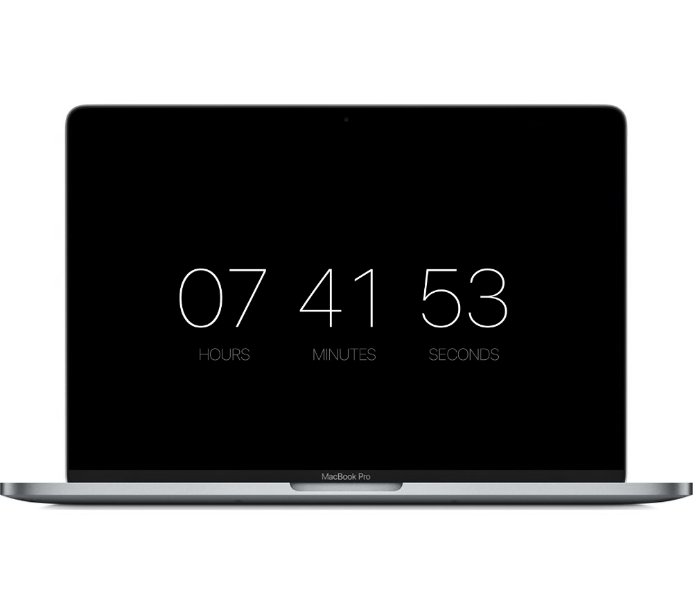

# MinimalClock #

MinimalClock is a MacOS screen saver that displays the time.

## How to install ##

[Click here to download](https://github.com/thomasjpr/MinimalClock/releases/download/1.1/MinimalClock.saver.zip).
* Unzip, double-click and confirm installation.
* Open the System Preferences, choose Screen Saver and activate MinimalClock.

## How to uninstall ##

Open the System Preferences, choose Screen Saver, right-click on MinimalClock and choose delete.

## Author ##

* [Mattia Rossini](https://github.com/mattiarossini)
* Forked by [Thomas Roberts](https://thomasjpr.com)

## Revision History

### 1.1
* Updated for Swift 5
* Added second indicator

### 1.0